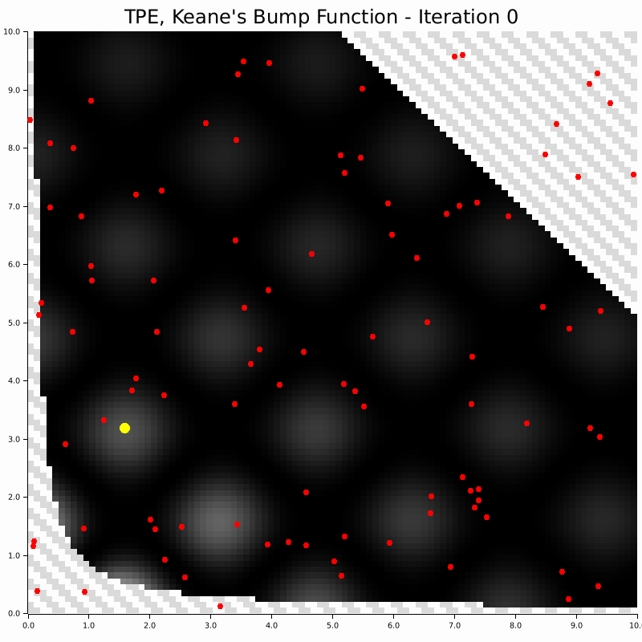

# Tree-Structured Parzen Estimator (TPE)

<div align="center">



<p><b>Figure:</b> Tree-Structured Parzen Estimator (TPE) is a Bayesian optimization algorithm that auto-magically balances exploration and exploitation by modeling the objective function using kernel density estimation (KDE). It adapts its sampling strategy based on observed performance.</p>

</div>

TPE is a sequential model-based optimization (SMBO) algorithm that uses KDE to model the objective likelihood. It maintains two density models:
- $l(x)$: Distribution of good observations (top γ% of samples)
- $g(x)$: Distribution of all observations

## Kernel Density Estimation

TPE uses KDE to model the objective:

$$
\hat{f}(x) = \frac{1}{n h} \sum_{i=1}^n K\left(\frac{x - x_i}{h}\right)
$$

Where:
- $K$: Kernel function (Gaussian, Epanechnikov, etc.)
- $h$: Bandwidth parameter
- $n$: Number of observations

See [this notebook](https://github.com/PritRaj1/hilbert-mcmc/blob/main/rkhs.ipynb) for more information.

## Bandwidth Selection Methods

| Method | Description | Pros | Cons |
|--------|-------------|------|------|
| **Silverman** | Rule-of-thumb based on data variance | Fast, simple | May not be optimal |
| **Cross-Validation** | Leave-one-out cross-validation | Data-driven | Computationally expensive |
| **Adaptive** | Local density-based adjustment | Adapts to data structure | Sensitive to noise |
| **Likelihood** | Maximum likelihood optimization | Theoretically good | Can be unstable |

## Acquisition Functions

| Function | Formula | Notes |
|----------|---------|----------|
| **Expected Improvement** | $$\mathrm{EI}(x) = \frac{l(x)}{g(x)}$$ | Balances exploration/exploitation |
| **Upper Confidence Bound** | $$\mathrm{UCB}(x) = \mu(x) + \kappa \cdot \sigma(x)$$ | Exploration-focused |
| **Probability of Improvement** | $$\mathrm{PI}(x) = P(f(x) < f(x^+))$$ | Exploitation-focused |
| **Entropy Search** | $$\mathrm{ES}(x) = H(p(f(x)))$$ | Information-theoretic |


## Config example

Fully-defined:

```json
{
    "alg_conf": {
        "TPE": {
            "advanced": {
                "use_restart_strategy": true,
                "restart_frequency": 50,
                "use_adaptive_gamma": true,
                "use_meta_optimization": true,
                "meta_optimization_frequency": 10,
                "use_early_stopping": true,
                "early_stopping_patience": 20,
                "use_constraint_aware": true
            },
            "bandwidth": {
                "method": "Adaptive",
                "cv_folds": 5,
                "adaptation_rate": 0.1,
                "min_bandwidth": 1e-6,
                "max_bandwidth": 10.0
            },
            "acquisition": {
                "acquisition_type": "ExpectedImprovement",
                "xi": 0.01,
                "kappa": 2.0,
                "use_entropy": false,
                "entropy_weight": 0.1
            },
            "sampling": {
                "strategy": "Hybrid",
                "adaptive_noise": true,
                "noise_scale": 0.1,
                "use_thompson": true,
                "local_search": true,
                "local_search_steps": 10
            }
        }
    }
}
```

Default values:
```json
{
    "alg_conf": {
        "TPE": {}
    }
}
```

## Sources and References

- [TPE in Python](https://github.com/nabenabe0928/tpe/tree/single-opt)
- [TPE intuition](https://arxiv.org/abs/2304.11127)
- [Sequential Model-Based Global Optimization (SMBO)](https://proceedings.neurips.cc/paper_files/paper/2011/file/86e8f7ab32cfd12577bc2619bc635690-Paper.pdf)
- [Meta-optimization to tune TPE](https://en.wikipedia.org/wiki/Meta-optimization)