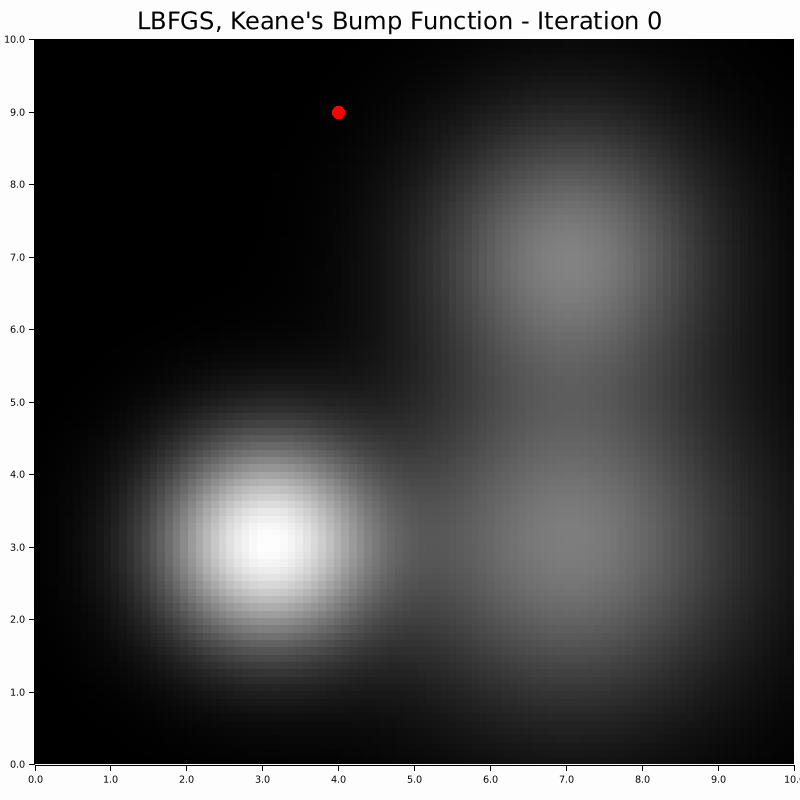

# Limited Memory BFGS

<div align="center">



<p><b>Figure:</b> The Limited Memory Broyden–Fletcher–Goldfarb–Shanno (L-BFGS) algorithm is a quasi-Newton optimization method that approximates the inverse Hessian matrix using a limited amount of memory. This makes it suitable for large-scale problems. L-BFGS can be paired with various line search strategies. When box constraints are required, the L-BFGS-B variant is used.</p>

</div>

## Line Search Methods


| Method | Notes |
|--------|-------|
| Backtracking | Simple line search that reduces step size until Armijo condition is met |
| Strong Wolfe | Enforces both sufficient decrease and curvature conditions for more robust convergence |
| Hager-Zhang | Advanced line search with adaptive bracketing strategy, good for ill-conditioned problems |
| More-Thuente | Robust cubic interpolation line search that ensures steady progress |
| Golden Section | Classical line search using golden ratio, reliable but slower convergence |

The two most suited for L-BFGS are the Wolfe methods; Strong Wolfe and More-Thuente. I typically use More-Thuente.

## Config example

Fully-defined:

```json
{
    "alg_conf": {
        "LBFGS": {
            "common": {
                "memory_size": 10
            },
            "line_search": {
                "MoreThuente": {
                    "ftol": 1e-4,
                    "gtol": 0.9,
                    "max_iters": 100
                }
                // or
                "StrongWolfe": {
                    "c1": 0.0001,
                    "c2": 0.9,
                    "max_iters": 100
                }
                // or 
                "HagerZhang": {
                    "c1": 0.0001,
                    "c2": 0.9,
                    "theta": 0.5,
                    "gamma": 0.5,
                    "max_iters": 100
                }
                // or
                "GoldenSection": {
                    "tol": 1e-6,
                    "max_iters": 100,
                    "bracket_factor": 2.0
                }
                // or
                "Backtracking": {
                    "c1": 0.0001,
                    "rho": 0.5,
                    "max_iters": 100
                }
            }
        }
    }
}
```

Default values, (only choices of line search must be specified): 

```json
{
    "alg_conf": {
        "LBFGS": {
            "common": {},
            "line_search": {
                "MoreThuente": {}
            }
        }
    }
}
```

## Sources and more information

- [L-BFGS](https://doi.org/10.1007/BF01589116)
- [L-BFGS and line search](https://doi.org/10.1007/978-0-387-40065-5)
- [L-BFGS-B](https://doi.org/10.1137/0916069)
- [Line search](https://doi.org/10.1145/192115.192132)
- [Hager-Zhang](https://doi.org/10.1145/1132973.1132979)