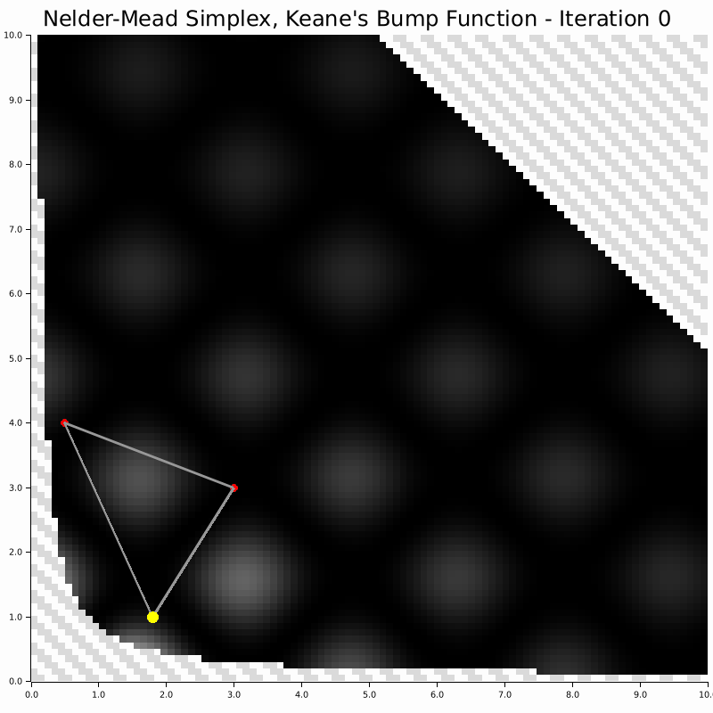

# Nelder-Mead

<div align="center">

<figure>
  
  <figcaption><b>Figure:</b> The Nelder-Mead method uses Simplex (a geometric figure with N+1 vertices in N-dimensional space) to search for the maximum of a function. The most important part of setting up this method is the choice of the initial Simplex. </figcaption>
</figure>

</div>

## Config example

Fully-defined:

```json
{
    "alg_conf": {
        "NM": {
            "alpha": 1.0,
            "gamma": 2.0,
            "rho": 0.5,
            "sigma": 0.5
        }
    }
}
```

Default values, (nothing needs to be specified):

```json
{
    "alg_conf": {
        "NM": {}
    }
}
```

## Sources and more information

- [Simplex](https://doi:10.1093/comjnl/7.4.308)
- [Downhill Simplex visuals (for convex opt)](https://www.brnt.eu/phd/node10.html#SECTION00622200000000000000)
- [Nelder-Mead may converge to non-stationary points](https://doi:10.1137/S1052623496303482)